# ScholarSync AI: Multi-Agent Research Orchestrator

[](https://nextjs.org/)
[](https://fastapi.tiangolo.com/)
[](https://github.com/langchain-ai/langgraph)
[](https://tailwindcss.com/)

**ScholarSync AI** is a high-performance research orchestration platform that deploys a decentralized swarm of specialized AI agents to automate the academic research lifecycle. From strategic planning and global data scouting to authority validation and cognitive synthesis, ScholarSync transforms complex inquiries into structured, peer-validated research blueprints.

<<<<<<< HEAD
## 🔄 Agentic Workflow

ScholarSync AI employs a strictly sequenced multi-agent orchestration pipeline. Each agent is specialized for a specific phase of the research lifecycle, ensuring high-fidelity outputs and peer-validated accuracy.

```mermaid
graph LR
    User([User Assignment]) --> Planner{{Strategic Planner}}
    Planner -- "4 Academic Pillars" --> Scout{{Global Data Scout}}
    Scout -- "Raw Data Stream" --> Validator{{Authority Validator}}
    Validator -- "Verified Nodes" --> Synthesizer{{Blueprint Synthesizer}}
    Synthesizer --> Output([Research Blueprint])

    style Planner fill:#6366f1,stroke:#fff,stroke-width:2px,color:#fff
    style Scout fill:#8b5cf6,stroke:#fff,stroke-width:2px,color:#fff
    style Validator fill:#ec4899,stroke:#fff,stroke-width:2px,color:#fff
    style Synthesizer fill:#06b6d4,stroke:#fff,stroke-width:2px,color:#fff
```


=======

>>>>>>> 884c3e9c8eb293dfbc90c713b631cc7d195c1fe4

## 🔬 Core Architecture: The Research Swarm

ScholarSync utilizes a sophisticated **Multi-Agentic RAG (Retrieval-Augmented Generation)** architecture powered by **LangGraph**. The workflow is decomposed into four specialized cognitive nodes:

1.  **Strategic Planner (DeepSeek R1)**: Decomposes complex research objectives into 4 distinct academic research pillars and investigative queries.
2.  **Global Data Scout (Llama 4 Scout)**: Executes deep-web searches across academic nodes and indexed repositories using the **Tavily API**.
3.  **Authority Validator (Logic-Driven)**: Performs domain credibility checks (filtering for .edu, .gov, arxiv.org, etc.) and source reputation analysis.
4.  **Blueprint Synthesizer (Llama 4 Scout)**: Aggregates validated intelligence into a comprehensive, formatted research manuscript with automated citation mapping.

## ✨ Key Features

- **Aurora Command Center UI**: A premium, glassmorphic interface featuring ambient glows and high-end typography (**Josefin Sans** & **Outfit**).
- **Real-time Pipeline Visualization**: Interactive horizontal status dashboard that tracks the movement of the agent cluster in real-time.
- **Contradiction Analysis Mode**: A specialized toggle that instructs agents to actively seek out dissenting opinions and peer-reviewed counter-arguments.
- **Source Mapping Matrix**: Dynamic mapping of every section of the research blueprint to its corresponding verified data nodes.
- **Multi-LLM Backbone**: Leverages state-of-the-art models including **DeepSeek-V3**, **LLaMA 3.1**, and **Google Gemini** via OpenRouter.


## 🛠️ Tech Stack

### Frontend

- **Framework**: Next.js 15 (App Router)
- **Styling**: Tailwind CSS (Aurora Studio Theme)
- **Animations**: Framer Motion
- **Icons**: Lucide React
- **Typography**: Google Fonts (Josefin Sans, Outfit)

### Backend

- **Framework**: FastAPI (Python)
- **Orchestration**: LangChain & LangGraph
- **Data Retrieval**: Tavily Search API
- **LLM Provider**: OpenRouter (Unified API for DeepSeek/LLaMA/Gemini)
- **Environment**: Python 3.14+ / Virtualenv

## 🚀 Getting Started

### Prerequisites

- Node.js 18+
- Python 3.11+
- API Keys: OpenRouter, Tavily

### Installation

1.  **Clone the Repository**:

    ```bash
    git clone https://github.com/Sravan2804/ScholarSync-AI.git
    cd ScholarSync-AI
    ```

2.  **Backend Setup**:

    ```bash
    python -m venv .venv
    .\.venv\Scripts\activate  # Windows
    pip install -r requirements.txt
    ```

3.  **Frontend Setup**:

    ```bash
    cd frontend
    npm install
    ```

4.  **Environment Configuration**:
    Create a `.env` in the root and `frontend/.env.local` with your respective API keys.

## 🤝 Contact

Built with ❤️ by [Sravan](https://github.com/Sravan2804)
